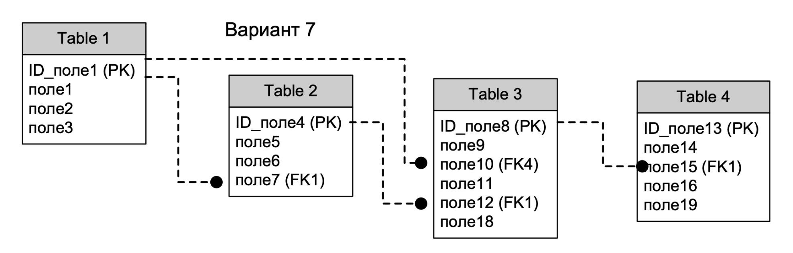

#### Вариант  

| № варианта курсовой работы. | предметная область                                                          | примерные отношения предметной области                                                                                  | Вариант схемы |
| --------------------------- | --------------------------------------------------------------------------- | ----------------------------------------------------------------------------------------------------------------------- | ------------- |
| 77                          |Система заключения и ведения хозяйственных договоров предприятия |Ведение базы данных договоров. Реквизиты договоров, агентов, контрагентов, юридические или физические лица, сроки и объекты действия договоров и т.п | 7      

#### Задание

Разработать клиент-серверное приложение, серверная часть которого должна быть реализована на **PostgreSQL**, представляющая собой модель предметной области в соответствии с вариантом задания. В рамках заданной предметной области реализовать заданную (по варианту) схему отношений, т.е. выделить сущности и их атрибуты, так чтобы связи между сущностями соответствовали представленной схеме. Допускается небольшое отступление от заданной схемы. В рамках курсовой работы необходимо на стороне сервера реализовать и использовать при демонстрации приложения следующие компоненты:

1. Постоянные таблицы и связи между ними, количество таблиц и наличие связей должно соответствовать заданию, допускается увеличение числа таблиц и их полей для более адекватного представления предметной области;
2. В приложении (на стороне клиента) реализовать не менее пяти запросов для демонстрации навыков работы.
3. Реализовать запросы по заданиям (в любых фрагментах скриптов как на стороне сервера, так и на стороне клиента):
	-  `a.` Составной многотабличный запрос с `CASE`-выражением;
	-  `b.` Многотабличный `VIEW`, с возможностью его обновления (использовать триггеры или правила);
	-  `c.` Материализованное представление;
	-  `d.` Запросы, содержащие подзапрос в разделах `SELECT`, `FROM` и `WHERE` (в каждом хотя бы по одному);
	-  `e.` Коррелированные подзапросы (минимум 3 запроса).
	-  `f.` Многотабличный запрос, содержащий группировку записей, агрегатные функции и параметр, используемый в разделе `HAVING`;
	-  `g.` Запросы, содержащие предикаты `ANY` и `ALL` (для каждого предиката);
4. Создать индексы (минимум 3 штуки) для увеличения скорости выполнения запросов; Предусмотреть индексы разных типов. Индексы должны быть созданы для разных таблиц. В отчет включить план запроса, показывающий применение индекса при выполнении запроса.
5. Во всех основных таблицах предусмотреть наличие триггеров на одно из событий (`DELETE`, `UPDATE`, `INSERT`), в каждой хотя бы по одному.
6. Реализовать две собственные триггерные функции, которые будут вызываться при изменениях данных или событиях в базе данных. Данные функции могут быть вызваны из триггеров задания п. 5;
7. Операции добавления, удаления и обновления реализовать в виде хранимых процедур или функций с параметрами для всех таблиц;
8. Реализовать отдельную хранимую процедуру, состоящую из нескольких отдельных операций в виде единой транзакции, которая при определенных условиях может быть зафиксирована или откатана;
9. Реализовать курсор на обновления отдельных данных (вычисления значения полей выбранной таблицы);
10. Реализовать собственную скалярную и векторную функции. Функции сохранить в базе данных;
11. Распределение прав пользователей: предусмотреть не менее двух пользователей с разным набором привилегий. Каждый набор привилегий оформить в виде роли.
12. Предусмотреть в курсовой работе минимум одну таблицу для хранения исторических данных (`OLAP`)
